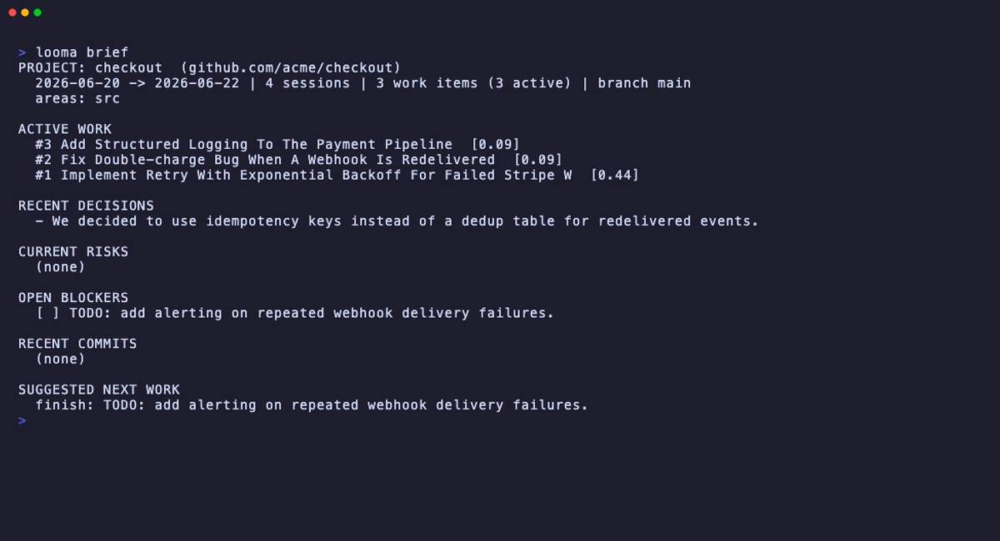
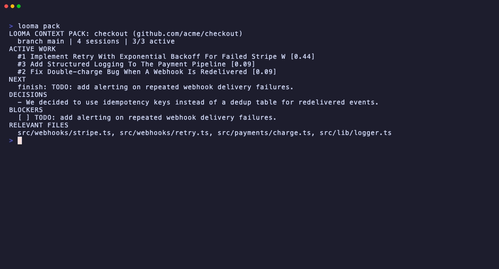

# Screenshots

Static stills from the [demo](../demo/), captured against a fully synthetic store
(see [../demo/gen_demo.py](../demo/gen_demo.py)) - no real history is shown.

| File         | Command       | What it shows                                              |
|--------------|---------------|------------------------------------------------------------|
| `brief.png`  | `looma brief` | 60-second orientation: active work, decisions, blockers    |
| `pack.png`   | `looma pack`  | the token-budgeted context pack handed to another agent    |

